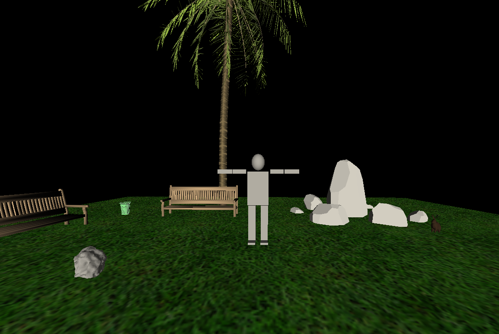
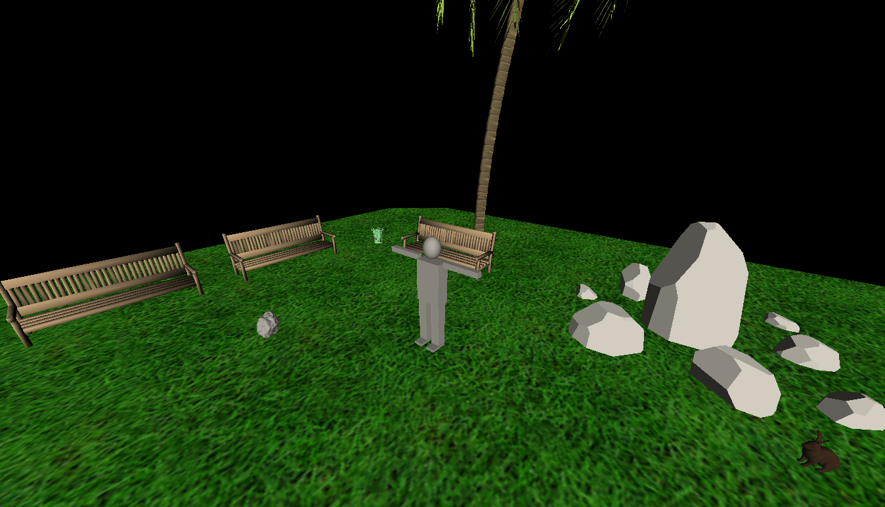
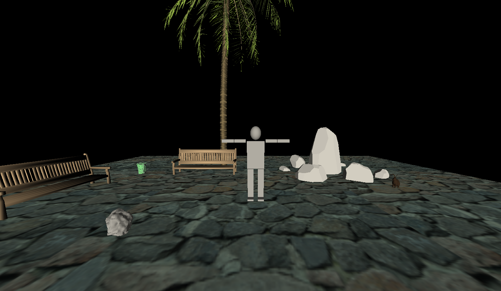
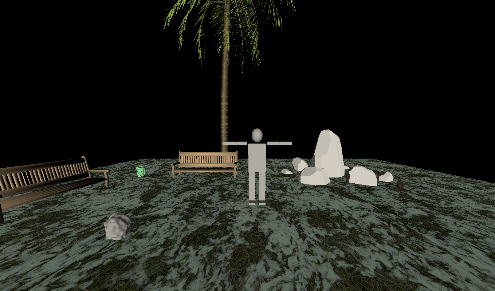
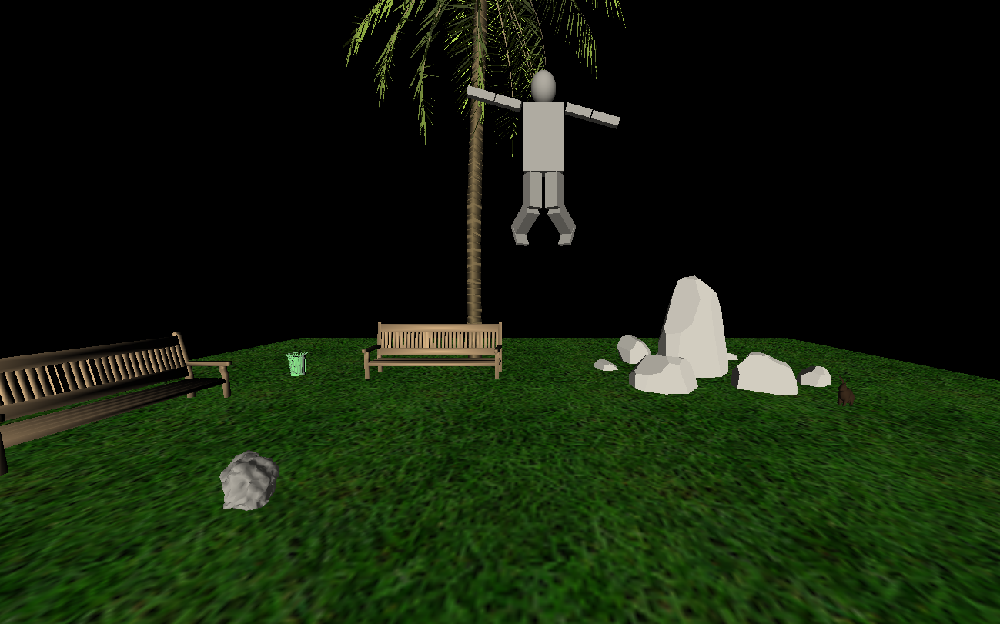
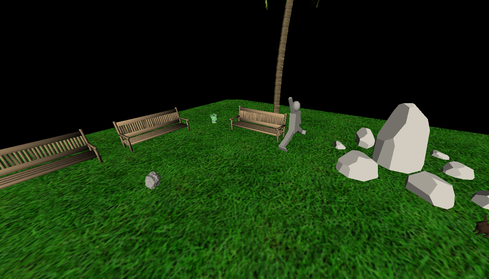
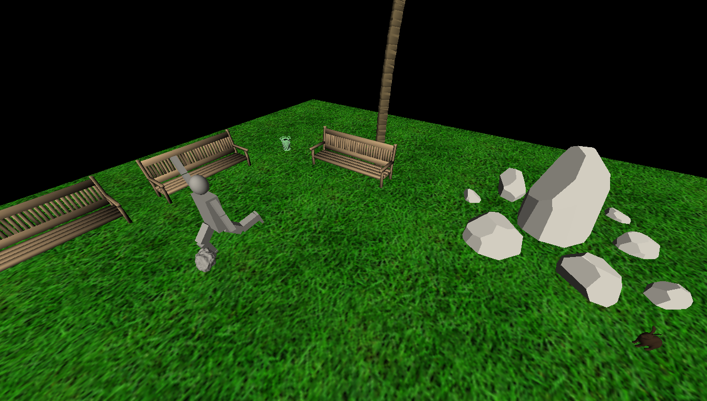
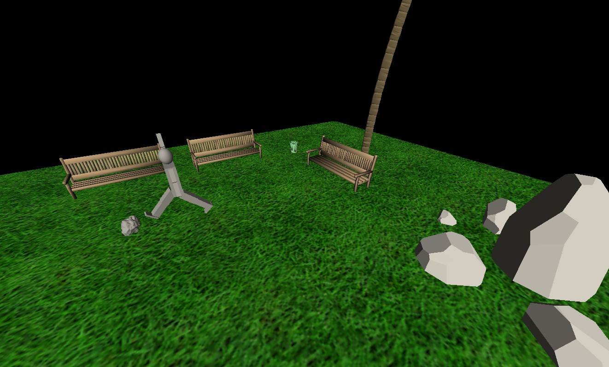

# Assignment 3 Report
## Project Summary:
 In this project we used the robotic body from the previous assignment and added three additional features:
 - Surrounding Environment:

    We loaded objects from different ( .obj ) files and draw a ground to construct the environment in which the robotic body is placed. The loaded objects are:
    - Rabbit.
    - Palmtree.
    - Three Benches.
    - Two Rocks (small and big one).
    - Trashcan

    So, The resulting scene is a man standing in a garden.
    

    
    

- Textures:

    We added three images as a texture for the ground to constitute different ground types, We can choose among them by using the main menue.  

    The resulting ground types are:
    - Grass Ground.
    - Rocky Ground.
    - Snow Ground.

    
    

- Animation:

    We made three different animations that can be selected from the main menue:

    - Jumping:

        This is the default animation whrere the robotic body jumps at its own position.

    - Dancing:

        The robotic body dances in a funy way while it is moving in the garden.   

    - Moving:

        In this animation the robotic body interacts with the small rock. The man moves toward this rock and kicks it far from his way.         

    
    
    
    

## Problems we faced
We faced different problems in the following:

 - Animatiom:

    It was difficult to construct an animation by using just numbers to adjust a lot of angels and positions, We overcomed this problem by using try and error technique.

 - Coding:

    There was a lot of logic and syntax errors that appeared mainly because the code was so long. We solved this problem by using the IDE features.

## Contributions

We taked some code blocks from tutorial 5 materials."# task3-graph-bio" 
